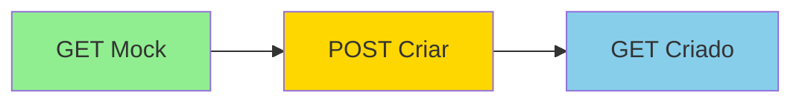

# ?? Desafio Técnico Aché - Integração SAP S/4HANA SD

[](https://dotnet.microsoft.com/)
[](LICENSE)
[](https://www.sap.com/)

> API REST desenvolvida em **.NET 8 (LTS)** para integração com o módulo **SAP S/4HANA SD (Sales & Distribution)** utilizando **OData REST API**.

---

## ?? Sobre o Projeto

Esta solução implementa operações de **GET** e **POST** para gerenciamento de pedidos de venda com dados mockados, simulando integração real com SAP.

### ? Características Principais

- ? API REST completa com GET e POST
- ? Integração SAP S/4HANA SD via OData (mockado)
- ? Clean Architecture + CQRS
- ? Segurança OWASP implementada
- ? Documentação Swagger/OpenAPI
- ? Dados mock realistas

---

## ??? Arquitetura

**Padrão**: Clean Architecture + CQRS

```
src/
??? ?? DesafioTecnico_Ache.API/          # Camada de Apresentação
?   ??? Controllers/                      # Controllers REST
?   ??? Middleware/                       # Security & Error Handling
?   ??? Program.cs                        # DI Container & Startup
?
??? ?? DesafioTecnico_Ache.Application/  # Camada de Aplicação
?   ??? Commands/                         # Write Operations (CQRS)
?   ??? Queries/                          # Read Operations (CQRS)
?   ??? DTOs/                             # Data Transfer Objects
?
??? ?? DesafioTecnico_Ache.Domain/       # Camada de Domínio
?   ??? Entities/                         # Domain Models
?   ??? Interfaces/                       # Abstractions
?
??? ?? DesafioTecnico_Ache.Infrastructure/ # Camada de Infraestrutura
    ??? Repositories/                      # Data Access
    ??? SAP/                               # SAP Integration (Mock)
```

### ?? Separação de Responsabilidades

| Camada | Responsabilidade |
|--------|------------------|
| **API** | Controllers, Middlewares, Validações de entrada |
| **Application** | Use cases (Commands/Queries), Orquestração, DTOs |
| **Domain** | Regras de negócio, Entidades, Interfaces |
| **Infrastructure** | Acesso a dados, Integrações externas (SAP) |

---

## ?? Segurança (OWASP Top 10 - 2021)

### Proteções Implementadas

| # | Vulnerabilidade | Proteção Implementada |
|---|-----------------|----------------------|
| **A01** | Broken Access Control | ? API Key obrigatória + Rate Limiting |
| **A02** | Cryptographic Failures | ? HTTPS Enforcement + TLS 1.2+ |
| **A03** | Injection | ? Validações de entrada + Tipos seguros |
| **A04** | Insecure Design | ? Clean Architecture + Fail-safe |
| **A05** | Security Misconfiguration | ? Security Headers + CORS |
| **A07** | Authentication Failures | ? API Key validation |
| **A09** | Security Logging Failures | ? Logging estruturado |

#### Detalhes de Implementação

**1. API Key Authentication**
```csharp
// Middleware customizado
X-API-Key: SAP-API-KEY-DEMO-2026-ACHE-DESAFIO
```

**2. Rate Limiting**
- 100 requisições por minuto por API Key
- Implementado com `System.Threading.RateLimiting`

**3. CORS Policy**
- Origens configuráveis via `appsettings.json`
- Apenas métodos GET e POST permitidos

**4. Security Headers**
- `X-Content-Type-Options: nosniff`
- `X-Frame-Options: DENY`
- `X-XSS-Protection: 1; mode=block`

---

## ?? Integração SAP S/4HANA

### Especificações Técnicas

| Item | Descrição |
|------|-----------|
| **Tipo de Integração** | OData REST API (Mockado) |
| **Módulo SAP** | SD (Sales & Distribution) |
| **Endpoint** | `/sap/opu/odata/sap/API_SALES_ORDER_SRV` |
| **Autenticação** | Basic Authentication |

### Operações Disponíveis

- `GET /A_SalesOrder('{orderId}')` - Buscar pedido por ID
- `POST /A_SalesOrder` - Criar novo pedido de venda

> **Nota**: A implementação utiliza armazenamento em memória compartilhado entre requests para simular persistência. Em produção, seria substituída por chamadas reais ao SAP OData API.

---

## ?? Endpoints da API

### 1?? GET - Buscar Pedido de Venda

**Request**
```http
GET /api/v1/salesorders/{orderId}
X-API-Key: SAP-API-KEY-DEMO-2026-ACHE-DESAFIO
```

**Response 200 OK**
```json
{
  "orderId": "SO20260108001",
  "customerCode": "CUST001",
  "customerName": "Farmácia Popular Ltda",
  "orderDate": "2026-01-03T00:00:00Z",
  "totalAmount": 437.50,
  "status": "CONFIRMED",
  "items": [
    {
      "itemId": "ITM001",
      "materialCode": "MAT001",
      "materialDescription": "Paracetamol 500mg",
      "quantity": 100,
      "unitPrice": 2.50,
      "totalPrice": 250.00
    }
  ]
}
```

---

### 2?? POST - Criar Pedido de Venda

**Request**
```http
POST /api/v1/salesorders
X-API-Key: SAP-API-KEY-DEMO-2026-ACHE-DESAFIO
Content-Type: application/json

{
  "customerCode": "CUST004",
  "customerName": "Farmácia Nova",
  "status": "PENDING",
  "items": [
    {
      "materialCode": "MAT001",
      "materialDescription": "Paracetamol 500mg",
      "quantity": 50,
      "unitPrice": 2.50
    }
  ]
}
```

**Response 201 Created**
```json
{
  "orderId": "SO20260108004",
  "customerCode": "CUST004",
  "customerName": "Farmácia Nova",
  "orderDate": "2026-01-08T12:00:00Z",
  "totalAmount": 125.00,
  "status": "PENDING",
  "items": [
    {
      "itemId": "ITMF2A3B4C5",
      "materialCode": "MAT001",
      "materialDescription": "Paracetamol 500mg",
      "quantity": 50,
      "unitPrice": 2.50,
      "totalPrice": 125.00
    }
  ]
}
```

### ?? Formato do Order ID

Padrão: `SO{yyyyMMdd}{nnn}`

| Parte | Descrição | Exemplo |
|-------|-----------|---------|
| `SO` | Prefixo SAP Sales Order | SO |
| `yyyyMMdd` | Data atual | 20260108 |
| `nnn` | Contador sequencial | 001, 002, 003... |

**Exemplo completo**: `SO20260108004`

---

## ?? Como Executar

### Pré-requisitos

- [.NET 8 SDK](https://dotnet.microsoft.com/download/dotnet/8.0)
- IDE de sua preferência (Visual Studio, VS Code, Rider)

### Passo a Passo

#### 1. Clonar o repositório
```bash
git clone https://github.com/RenanMunizDev/DesafioTecnico_Ache.git
cd DesafioTecnico_Ache
```

#### 2. Restaurar dependências
```bash
dotnet restore
```

#### 3. Build da solução
```bash
dotnet build
```

#### 4. Executar a API
```bash
cd src/DesafioTecnico_Ache.API
dotnet run
```

#### 5. Acessar Swagger
- URL: `https://localhost:7000/swagger` (ou porta indicada no console)
- Documentação interativa completa disponível

---

## ?? Testando a API

### Usando Swagger UI

1. Acesse o Swagger UI no navegador
2. Clique no botão **"Authorize"** ??
3. Insira a API Key: `SAP-API-KEY-DEMO-2026-ACHE-DESAFIO`
4. Clique em **"Authorize"** e depois **"Close"**
5. Teste os endpoints disponíveis

### Fluxo de Teste Recomendado



1. **GET** `/api/v1/salesorders/SO20260108001` ? Buscar pedido mock
2. **POST** `/api/v1/salesorders` ? Criar novo pedido (retorna `SO20260108004`)
3. **GET** `/api/v1/salesorders/SO20260108004` ? Buscar pedido criado

---

## ?? Dados Mock Disponíveis

A API já vem com **3 pedidos** pré-cadastrados para teste:

| Order ID | Cliente | Status | Itens | Total |
|----------|---------|--------|-------|-------|
| `SO20260108001` | Farmácia Popular Ltda | CONFIRMED | 2 | R$ 437,50 |
| `SO20260108002` | Drogaria Moderna S.A. | PROCESSING | 1 | R$ 840,00 |
| `SO20260108003` | Rede Saúde Plus | PENDING | 3 | R$ 1.359,00 |

> ?? **Importante**: Os pedidos criados via POST são persistidos em memória durante toda a execução da aplicação. Ao reiniciar a API, apenas os 3 pedidos mock estarão disponíveis novamente.

---

## ?? Boas Práticas Aplicadas

### SOLID Principles

| Princípio | Implementação |
|-----------|---------------|
| **S**ingle Responsibility | Cada classe tem uma única responsabilidade |
| **O**pen/Closed | Extensível via interfaces, fechado para modificação |
| **L**iskov Substitution | Interfaces substituíveis sem quebrar contrato |
| **I**nterface Segregation | Interfaces específicas e focadas |
| **D**ependency Inversion | Dependências via abstrações (DI) |

### Outros Princípios

- ? **DRY** (Don't Repeat Yourself) - Reutilização via abstrações
- ? **KISS** (Keep It Simple, Stupid) - Código simples e direto
- ? **YAGNI** (You Aren't Gonna Need It) - Apenas o necessário
- ? **Clean Code** - Nomenclatura clara, métodos pequenos

### Padrões de Projeto

- ??? **Clean Architecture** - Separação de camadas
- ? **CQRS** - Commands e Queries separados
- ?? **Repository Pattern** - Abstração de dados
- ?? **Dependency Injection** - IoC nativo do .NET
- ??? **Middleware Pattern** - Cross-cutting concerns

---

## ?? Notas Técnicas

### Implementações Destaque

1. **SAP OData Service Mock**
   - Simula chamadas reais ao SAP
   - Interface preparada para implementação real

2. **Repository Pattern**
   - Facilita testes unitários
   - Abstração completa de persistência

3. **CQRS**
   - Separação clara entre leitura e escrita
   - Queries otimizadas independentemente

4. **Validation**
   - Data Annotations nos DTOs
   - Validações de domínio nas entidades
   - Validações de aplicação nos handlers

5. **Logging Estruturado**
   - Contexto completo das operações
   - Troubleshooting facilitado

6. **Error Handling**
   - Status HTTP apropriados
   - Mensagens de erro consistentes

7. **Thread-Safety**
   - Operações protegidas com locks
   - Seguro para ambiente multi-thread

8. **ID Generation**
   - Formato sequencial consistente
   - Padrão SAP mantido

---

## ?? Roadmap para Produção

### Segurança
- [ ] Implementar OAuth 2.0 / JWT
- [ ] Adicionar API Gateway
- [ ] Implementar certificados cliente

### Performance
- [ ] Cache distribuído (Redis)
- [ ] Circuit breaker (Polly)
- [ ] Connection pooling otimizado

### Qualidade
- [ ] Testes unitários (xUnit)
- [ ] Testes de integração
- [ ] Testes de carga (k6, JMeter)
- [ ] Code coverage > 80%

### Observabilidade
- [ ] OpenTelemetry
- [ ] Application Insights
- [ ] Distributed tracing
- [ ] Health checks

### Dados
- [ ] SQL Server / SAP HANA
- [ ] Entity Framework Core
- [ ] Migrations automatizadas
- [ ] Backup strategy

### DevOps
- [ ] CI/CD Pipeline
- [ ] Docker containers
- [ ] Kubernetes deployment
- [ ] Infrastructure as Code

---

## ?? Licença

Este projeto foi desenvolvido como parte de um desafio técnico.

---

## ????? Autor

**Renan Muniz**

[](https://github.com/RenanMunizDev)

---

## ?? Conformidade

? **API REST** em .NET 8 (LTS)  
? **GET + POST** implementados  
? **Integração SAP** S/4HANA SD (OData)  
? **Dados mockados** funcionais  
? **Código limpo** e bem estruturado  
? **Boas práticas** (SOLID, DRY, KISS)  
? **Padrão de projeto** (Clean Architecture + CQRS)  
? **Segurança OWASP** implementada  

---

<div align="center">

**Desenvolvido com ?? seguindo as melhores práticas de arquitetura de software e segurança**

? Se este projeto foi útil, considere dar uma estrela!

</div>
